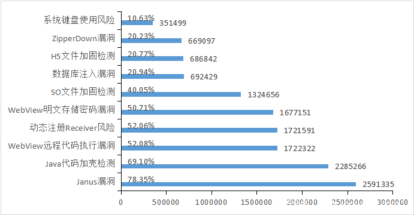

## android sec学习笔记

## 逆向应用场景
* app安全审查
* 系统漏洞挖掘
* 恶意代码查杀
* 同行技术原理分析
* 移除安全机制
* 病毒分析

## 知识点
* Java基础（JCA,JSSE)
* 文件格式（DEX, OAT, ELF, Smali, resources.arsc)
* Smali阅读, arm反汇编阅读
* Apktool, smali/baksmali, enjarify, android-classyshark, jadx, 
* jadx, JD-GUI, BytecodeViewer, Android Killer
* JEB, jdb, Android Studio/Intellij IDEA, gdb, IDA pro

## 技能表
1. 操作系统安全架构
2. 操作系统中可执行文件格式
3. 反汇编工具的使用
4. 反汇编代码的阅读理解
5. 调试器的使用
6. 网络抓包工具的使用
7. 加解密知识

## 漏洞类别

* WebView远程代码执行
* WebView明文存储
* SharedPrefs任意读写
