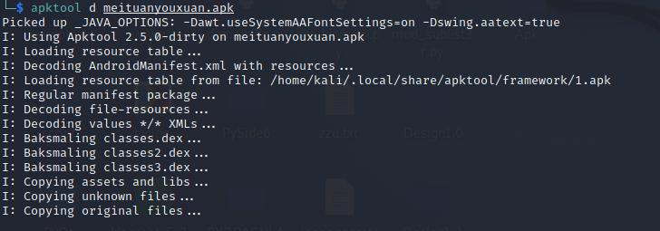

# Apktool
*特性*
* 反编译资源文件（resources.arsc, classes.dex, 9.png, xmls)
* 将反编译得到的资源文件重建成apk/jar
* 组织处理依赖框架资源的apk
* Smali调试 （2.1.0后移除，IdeaSmali)

*前置知识*
* Java8(JRE 1.8)
* Android SDK, AAPT and smali

## 0x01基本使用
* apk实际就是个压缩文件

### 使用`unzip`解压`apk`文件
```shell
unzip testapp.apk
```


```shell
apktool d testapp.apk
```

### 将jar文件解压 Decoding
```shell
apktool d fool.jar
```

### 重建foo.jar.out文件夹到 foo.jar.out/dist/foo.jar
```shell
apktool b foo.jar.out
```

```shell
apktool b bar -o new_bar.apk
```
### 框架
```shell
apktool if framework-res.apk
```

## 中级
